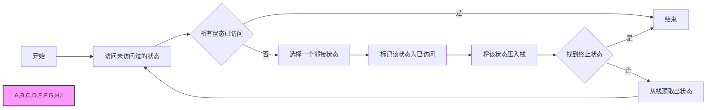
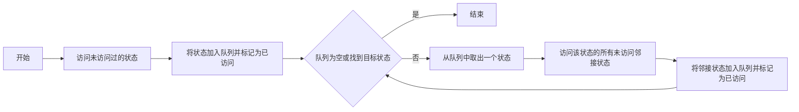
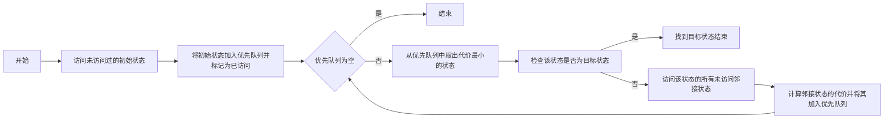
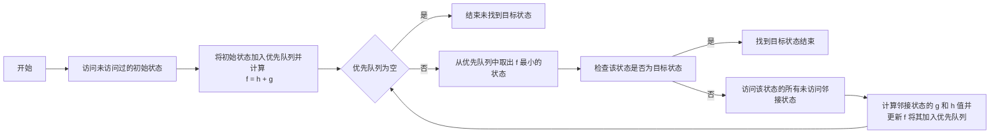

<span style="font-family:宋体; font-size:10.5pt;">
<center><h1>人工智能课程设计Project 1: Search</h1></center>

<center><big>2252941 杨瑞灵</big></center>

## 一、问题概述

### 1.1 问题直观描述

- 在这个项目中，我们需要编写通用的搜索算法，并将它们应用到 Pacman 游戏场景中，以帮助 Pacman 找到收集食物的最短路径；以及设计合适的状态和启发式函数，提升搜索的效率。
- 搜索方法：
  - DFS
  - BFS
  - UCS
  - A\*
  - 找到所有角落
  - 启发式搜索：角问题
  - 启发式搜索：找到所有食物

### 1.2 对项目已有代码的阅读和理解

- **util**

  - 实现了三种数据结构：栈(Stack)、队列(Queue)和优先队列(Priority Queue)
    - 栈:DFS
    - 队列:BFS
    - 优先队列:UCS
  - 实现哈夫曼距离(manhattanDistance)
  - 其他游戏需要的函数

- **search**

  - DPS、BFS、UCS、A\*搜索方法函数的实现。
  - 抽象定义了 SearchProblem 类，供另外三个问题继承。

- **searchAgent**

  - 实现了智能体 SearchAgent 类，代理（Agent）类是指控制游戏中实体行为的类。
    游戏中可能会有多个代理，每个代理都有自己的行为和决策机制。代理类通常会实现特定的接口或继承特定的基类。像这里 SearchAgent 作为其他具体代理的基类，参数'-p'来设置调用的代理类型
  - PositionSearchProblem 类继承了 SearchProblem，是前四个 Question 所需解决的问题。主要看他的成员函数：

    - getStartState, 返回开始状态
    - isGoalState, 判断当前状态是否为目标状态
    - get Successors, 返回可执行的下一步操作。该函数返回一个 list，list 中的元素时一个三元组，分别为
      - 下一步的状态。
      - 进入下一步所需执行的动作。
      - 执行该动作所需的消费。

    ```
    [((5, 4), 'South', 1), ((4, 5), 'West', 1)]
    [((5, 5), 'North', 1), ((5, 3), 'South', 1)]
    [((5, 4), 'North', 1), ((4, 3), 'West', 1)]
    [((4, 2), 'South', 1), ((5, 3), 'East', 1)]
    [((4, 3), 'North', 1), ((3, 2), 'West', 1)]
    ```

  - \*\*Heuristic：各种启发式函数，用来和 cost 一起在启发式 A\*搜索里面进行代价排序

### 1.3 解决问题的思路和想法

1. 首先，需要仔细阅读代码和注释，理解提供的搜索算法框架，并实现其中的 DFS、BFS、UCS、A\*等算法的具体实现。
2. 在实现搜索算法的过程中，需要注意数据结构的选择和实现细节，例如，在 UCS 和 A\*算法中需要使用优先队列来保存候选状态，项目已有的代码中提供了优先队列的实现。
3. 对于 corners 问题，需要仔细设计状态表示，以便实现 BFS、UCS、A\*等算法。此外，还需要实现一个非平凡的启发式函数，可以采用曼哈顿距离等常用的距离函数。
4. 对于 food 问题，需要设计状态表示和启发式函数，同时需要实现一些优化技巧，例如使用启发式搜索来缩小搜索空间。对于 ClosestDotSearchAgent，需要实现 findPathToClosestDot 函数，这可以使用 BFS 等算法来实现。
5. 在实现过程中，需要注意代码的效率和性能，尤其是在使用启发式搜索时，需要仔细权衡启发式函数的准确性和搜索时间的代价，避免不必要的计算和搜索。

## 二、算法设计与实现

- 为了让报告结构紧凑，将算法设计和算法实现合成一个模块进行说明。下面我将依次说明各个 Question 的我采用的算法。

### 2.1 深度优先搜索

#### 2.1.1 算法功能

- DFS 是一种盲目搜索算法，通过不断扩展深度方向上的状态，直到找到目标状态或无法继续搜索为止。DFS 的主要优点是空间复杂度较小，只需要维护一个栈即可。但其缺点是可能会陷入局部最优解，因此不适用于需要找到全局最优解的问题。

#### 2.1.2 设计思路

- 从一个起始状态开始，探索其子状态，再探索子状态的子状态，直到没有更多的子状态可供探索。如果此时还没有找到目标状态，算法会回溯到上一层状态，并探索另一个子状态，直到找到目标状态或所有状态都被遍历。

#### 2.1.3 算法流程图



#### 2.1.4 代码实现

- 使用函数递归来实现深搜。在找到目标状态后，直接返回 True，立即终止深搜，可以不用遍历完全部状态，提升效率。

- 函数参数：
  - actions 记录搜索路径
  - state 当前状态
  - problem 问题，起到提供地图等功能
  - vis 标记访问过的状态

```python
def mydfs(actions, state, problem, vis):
    # 找到目标状态返回
    if problem.isGoalState(state):
        return True
    # 获取下一步可能的所有状态
    successors = problem.getSuccessors(state)
    # 遍历下一步可能的状态
    for nxt_state, action, _ in successors:
        # 如果该状态已经访问，跳过
        if vis.get(nxt_state, False):
            continue
        # 记录动作
        actions.append(action)
        # 标记状态已访问
        vis[nxt_state] = True
        # 深搜，如果找到目标状态返回
        if mydfs(actions, nxt_state, problem, vis):
            return True
        # 回溯动作
        actions.pop()
    return False

def depthFirstSearch(problem: SearchProblem):
    actions = []  # 动作
    start = problem.getStartState()  # 起始状态
    vis = {start: True}  # 标记是否已访问的字典
    mydfs(actions, start, problem, vis)  # 深搜
    return actions  # 返回动作列表
```

- 但是这样没法实现最优，所以如果要找最优解需要全部遍历。不过好像测评函数认为这样是不对的所以没给过 hh

```py
def mydfs(actions_mincos:list, actions:util.Stack, state:tuple[int,int], problem:SearchProblem, vis:dict, cos:int):
    if problem.isGoalState(state):
        if len(actions_mincos) > cos or len(actions_mincos) == 0:
            actions_mincos.clear()
            actions_mincos.extend(actions.list)
        return
    # 剪枝
    if cos >= len(actions_mincos) and len(actions_mincos) != 0:
        return
    successors = problem.getSuccessors(state)
    # 遍历下一步可能的状态
    for next_state, action, cost in successors:
        # 如果已经访问过就跳过
        if vis.get(next_state, False):
            continue
        actions.push(action)
        vis[next_state] = True
        cos += cost
        mydfs(actions_mincos, actions, next_state, problem, vis, cos)
        # 回溯
        actions.pop()
        vis.pop(next_state)
        cos -= cost
    return

def depthFirstSearch(problem: SearchProblem):
    actions = util.Stack()  # 动作
    actions_mincos = []  # 记录消耗最小的动作  记录最小消耗
    start = problem.getStartState()  # 起始状态
    vis = {start: True}  # 标记是否已访问的字典
    mydfs(actions_mincos, actions, start, problem, vis, 0)  # 深搜
    # print(actions_mincos)
    return actions_mincos  # 返回动作列表
    util.raiseNotDefined()
```

### 2.2 广度优先搜索

#### 2.2.1 算法功能

- BFS 也是一种盲目搜索算法，与 DFS 不同的是，BFS 是按照广度优先的顺序扩展状态，即先扩展与起始状态距离为 1 的所有状态，再扩展与起始状态距离为 2 的所有状态，以此类推。BFS 的优点是能够保证找到全局最优解，但其缺点是空间复杂度较大，需要维护一个队列。

#### 2.2.2 设计思路

- BFS 会维护一个先进先出的队列，将当前节点的未被访问的邻居节点加入队列中，依次访问队列中的节点直到队列为空。

#### 2.2.3 算法流程图



#### 2.2.4 代码实现

- 用队列实现广搜。队列是一个先进先出的数据结构。

```python
def breadthFirstSearch(problem: SearchProblem):
    myqueue = util.Queue()
    actions = []
    start = problem.getStartState()  # 起始状态
    vis = {start: True}  # 标记是否已访问的字典
    myqueue.push([start, []])
    while not myqueue.isEmpty():
        state, actions = myqueue.pop()
        # 已经找到
        if(problem.isGoalState(state)):
            return actions
        successors = problem.getSuccessors(state)
        # 遍历所有方向
        for state_t, direction, cos in successors:
            # 是否已经经过
            if vis.get(state_t, False):
                continue
            myqueue.push([state_t, actions + [direction]])
            vis[state_t] = True
    return actions
    util.raiseNotDefined()
```

### 2.3 一致代价搜索

#### 2.3.1 算法功能

- 一致代价搜索在图中根据边的代价进行搜索。它使用优先级队列（通常是最小堆）来存储未访问的顶点，优先选择边的总代价最小的顶点进行扩展。

#### 2.3.2 设计思路

- UCS 类似广搜，但是搜索序列并非按入队的顺序排序，而是优先搜索代价最小的路径，从而保证总代价最小。
- 当遇到搜索过的状态时，需要继续放进去该状态的消费，而不是直接跳过该状态。直到结果出列

#### 2.3.3 算法流程图



#### 2.3.4 代码实现

- 用优先队列实现，维护一个代价的小顶堆。遍历下一步所有可能状态的时候，全部 push 进优先队列。可以证明，对于每个状态，第一次搜索到该状态时所需代价是最小的。

```python
def uniformCostSearch(problem: SearchProblem):
    myqueue = util.PriorityQueue()
    actions = []
    start = problem.getStartState()  # 起始状态
    vis = {start: True}  # 标记是否已访问的字典
    myqueue.push([start, [], 0], 0)  # 当前状态，活动列表，代价     优先级
    while not myqueue.isEmpty():
        state, actions, cost = myqueue.pop()
        # 已经找到
        if problem.isGoalState(state):
            return actions
        successors = problem.getSuccessors(state)
        # 遍历所有方向
        for state_t, direction, cost_t in successors:
            # 是否已经经过
            if state_t in vis:
                continue
            myqueue.push([state_t, actions + [direction], cost_t + cost], cost_t + cost)
            if not problem.isGoalState(state_t):
                vis[state_t] = True
    return actions
```

### 2.4 A\*搜索

#### 2.4.1 算法功能

- A\*搜索是一种更高效的搜索算法，它通过结合启发式函数（估计到目标的距离）来进行更有针对性的搜索。如果启发式函数是可接受的，则 A\*搜索将在扩展的节点数量方面优于 UCS。在实现 A\*算法时，需要选择合适的启发式函数，保证它既是可接受的（不高估实际代价），也是一致的（不会导致路径长度不一致）。

#### 2.4.2 设计思路

- 和 UCS 的设计思路很类似，只不过存入优先队列中的数据并不是当前路径的代价，而要加上启发式函数的值。

#### 2.4.3 算法流程图

- g 表示当前路径代价，h 表示当前路径启发式函数的值。



#### 2.4.4 代码实现

- 与 UCS 代码十分类似，只在不同的地方添加注释。

```python
def aStarSearch(problem: SearchProblem, heuristic=nullHeuristic):
    myqueue = util.PriorityQueue()
    actions = []
    start = problem.getStartState()  # 起始状态
    vis = {start: True}  # 标记是否已访问的字典
    myqueue.push([start, [], 0], 0)  # 当前状态，活动列表，代价     优先级
    while not myqueue.isEmpty():
        state, actions, cost = myqueue.pop()
        # 已经找到
        if problem.isGoalState(state):
            return actions

        # 遍历所有方向
        for state_t, direction, cost_t in problem.getSuccessors(state):
            # 是否已经经过
            if state_t in vis:
                continue

            #状态里存储当前路径的代价，而优先队列里比较 代价+启发式函数值
            myqueue.push([state_t, actions + [direction], cost_t + cost], cost_t + cost + heuristic(state_t, problem))
            if not problem.isGoalState(state_t):
                vis[state_t] = True
    return actions
```

### 2.5 找到所有角落

#### 2.5.1 问题描述

- 本题要求实现 CornersProblem 搜索问题，需要找到通过迷宫的最短路径，并保证该路径经过所有四个角落（无论迷宫中是否有食物）。该函数应具有抽象状态表示，以编码检测是否已到达所有四个角落所需的所有信息。

#### 2.5.2 状态设计

- 原本的 PositionProblem 问题里，状态只有一个二元组表示当前位置。
- 在其基础上，我增加了 4 个元素，分别表示迷宫的左上、左下、右上、右下是否已经到达过。

例如：

```python
(4, 5, True, True, False, False)
```

表示当前所在位置为(4,5)，已到达过右上、左上，没有经过左下、右下角。

#### 2.5.3 代码实现

```py
class CornersProblem(search.SearchProblem):
    def __init__(self, startingGameState: pacman.GameState):
        """
        存储墙壁、小精灵的起始位置和角落。
        """
        self.walls = startingGameState.getWalls()
        self.startingPosition = startingGameState.getPacmanPosition()
        top, right = self.walls.height-2, self.walls.width-2
        self.corners = ((1,1), (1,top), (right, 1), (right, top))
        for corner in self.corners:
            if not startingGameState.hasFood(*corner):
                print('Warning: no food in corner ' + str(corner))
        self._expanded = 0
        "*** YOUR CODE HERE ***"

    def getStartState(self):
        """
        返回起始状态（在您的状态空间中，而不是完整的 Pacman 状态空间中）
        """
        "*** YOUR CODE HERE ***"
        return self.startingPosition + (False, False, False, False)
        util.raiseNotDefined()

    def isGoalState(self, state: Any):
        """
        返回该搜索状态是否是问题的目标状态。
        """
        "*** YOUR CODE HERE ***"
        if (state[2] & state[3] & state[4] & state[5]) is True:
            return True
        return False
        util.raiseNotDefined()

    def getSuccessors(self, state: Any):
        """
        返回后继状态、它们所需的动作和成本为 1。
        如 search.py 中所述：
            对于给定的状态，如果此函数返回一个三元组列表，则其中包含后继状态、到达该状态所需的动作和扩展到该后继状态的增量成本，
            其中 'successor' 是当前状态的一个后继状态，'action' 是到达该状态所需的动作，'stepCost' 是扩展到该后继状态的增量成本
        """
        successors = []
        for action in [Directions.NORTH, Directions.SOUTH, Directions.EAST, Directions.WEST]:
            # 如果动作合法，则将后继状态添加到后继列表中
            "*** YOUR CODE HERE ***"
            x, y, _, _, _, _ = state
            getcorner = list(state[2:])
            dx, dy = Actions.directionToVector(action)
            nextx, nexty = int(x + dx), int(y + dy)
            if not self.walls[nextx][nexty]:
                nextState = (nextx, nexty)
                for i in range(0,4):
                    if (nextx, nexty) == self.corners[i]:
                        getcorner[i] = True
                cost = 1
                successors.append((nextState + tuple(getcorner), action, cost))

        self._expanded += 1 # 请勿更改
        return successors

    def getCostOfActions(self, actions):
        """
        返回特定动作序列的成本。如果这些动作包括非法移动，则返回 999999。此方法已为您实现。
        """
        if actions == None: return 999999
        x,y= self.startingPosition
        for action in actions:
            dx, dy = Actions.directionToVector(action)
            x, y = int(x + dx), int(y + dy)
            if self.walls[x][y]: return 999999
        return len(actions)
```

### 2.6 角落问题的启发式

#### 2.6.1 问题描述

- 编写一个启发式函数，让 A\*搜索所需要遍历的状态尽可能少，解决上述角落问题。

#### 2.6.2 设计思路

- 启发式函数：当前位置到角落的最小曼哈顿距离，再加上把各个角落连起来的最小曼哈顿距离

#### 2.6.3 代码实现

```python
def cornersHeuristic(state: Any, problem: CornersProblem):
    """
    A heuristic for the CornersProblem that you defined.

      state:   The current search state
               (a data structure you chose in your search problem)

      problem: The CornersProblem instance for this layout.

    This function should always return a number that is a lower bound on the
    shortest path from the state to a goal of the problem; i.e.  it should be
    admissible (as well as consistent).
    """
    corners = problem.corners # These are the corner coordinates 元组
    walls = problem.walls # These are the walls of the maze, as a Grid (game.py)

    "*** YOUR CODE HERE ***"
    # 启发式函数的定义
    # 选择最小的曼哈顿距离
    x, y, _, _, _, _ = state
    getcorner = list(state[2:])
    h = 0
    j = -1
    while 1:
        h1 = 999999
        for i in range(4):
            if getcorner[i] == True:
                continue
            t = util.manhattanDistance([x,y],corners[i])
            if t < h1:
                h1 = t
                j = i
        if j == -1:
            break
        h += h1
        x = corners[j][0]
        y = corners[j][1]
        getcorner[j] = True
        j = -1
    return h
```

### 2.7 吃到所有食物


#### 2.7.1 问题描述

- 编写一个启发式函数，让 A\*搜索所需要遍历的状态尽可能少，解决“吃到所有食物”问题。
- “吃到所有食物”即吃豆人要经过图上所有有食物的位置。该问题的状态设计已经实现好了。

#### 2.7.2 设计思路

- 和 2.6 的思路一样，计算当前位置与没访问过的所有食物中曼哈顿距离最小值。
- 再加上 food 之间最小的 k-1 个曼哈顿距，每次找到 food[0]到其他 food 最小距离，就删掉 food[0],找 food[1]到其他 food，依次进行，直到找完 food 数目-1 个距离
- 但是超时，所以限制五个 food 距离就退出循环

  最终遍历状态 `3747` 次，拿到 5 分。

#### 2.7.3 代码实现

```python
def foodHeuristic(state: Tuple[Tuple, List[List]], problem: FoodSearchProblem):
    position, foodGrid = state
    "*** YOUR CODE HERE ***"
    hfood = 0
    hf_pac = 9999999
    foodlocation = foodGrid.asList()
    if len(foodlocation) == 0:
        return 0
    for i,food1 in enumerate(foodlocation):
        # dis = util.manhattanDistance(food1,position)
        dis = mazeDistance(food1,position,problem.startingGameState)
        hf_pac = min(dis, hf_pac)  # 吃豆人所在位置到food最小曼哈顿距离
    for i,food1 in enumerate(foodlocation):
        fooddistance = util.PriorityQueue()
        for j,food2 in enumerate(foodlocation[i + 1:]):
            # dis = util.manhattanDistance(food1,food2)
            dis = mazeDistance(food1,food2,problem.startingGameState)
            fooddistance.push(dis,dis)
        if fooddistance.isEmpty() or i > 5:
            break
        hfood += fooddistance.pop() # food之间最小的k-1个曼哈顿距离
    return hfood + hf_pac
```

### 2.8 次优搜索

#### 2.8.1 问题描述

有时候即使使用 A\* 算法和良好的启发式函数，找到通过所有点的最优路径也很困难。

编写一个贪心算法，让吃豆人总是吃掉最近的点。

#### 2.8.2 设计思路

对与每一个状态，进行一次广搜，当第一个搜索到有食物的位置，就执行走到这个食物位置的这个动作列表。

#### 2.8.3 代码实现

```python
        # 深度优先搜索
        myqueue = util.Queue()
        actions = []
        vis = {startPosition: True} # 标记是否已访问的字典
        myqueue.push((startPosition, []))
        while not myqueue.isEmpty():
            (cx, cy), actions = myqueue.pop()
            if food[cx][cy]: # 直到找到食物
                return actions
            for direction in [Directions.NORTH, Directions.SOUTH, Directions.EAST, Directions.WEST]:
                dx, dy = Actions.directionToVector(direction)
                nxt = (nx, ny) = (int(cx + dx), int(cy + dy))
                if vis.get(nxt, False) or walls[nx][ny]:
                    continue
                vis[nxt] = True
                myqueue.push((nxt, actions + [direction]))
        return actions
```

## 三、实验结果

总分 26/25


测试数据如果无特殊内容就省略。

### 3.1 深度优先搜索 -->

#### 3.1.1 测试截图


#### 3.1.2 测试用例

检测是否为陷入死循环：


### 3.2 广度优先搜索

#### 3.2.1 测试截图


#### 3.2.2 测试用例

比较深搜和广搜的区别


### 3.3 一致代价搜索

#### 3.3.1 测试截图


#### 3.3.2 测试用例

边上带权重的测试数据


### 3.4 A\*搜索


### 3.5 找到所有角落


### 3.6 角落问题启发式


### 3.7 吃到所有食物

只需要 4137 次遍历，远超 hard 模式要求，拿到额外附加分。


### 3.8 次优搜索


## 四、总结与分析

- 从这个作业中，我们学习了一些基本的搜索算法，例如深度优先搜索、广度优先搜索、一致代价搜索和 A\*搜索。我们还将算法应用于吃豆人游戏，并实现了解决从起点到达目标状态的算法。此外，我们还学习了如何将这些算法扩展到解决更复杂的问题，例如找到所有角落、吃掉所有的食物等。
- 在实现这些算法的过程中，我们还学习了一些重要的概念，例如状态表示、剪枝和启发式搜索。我们还学习了如何实现和比较不同的启发式函数，并在保证一致性的情况下使用它们。
- 深度优先搜索适用于搜索空间比较大且解比较深的问题，但由于其搜索方式的特点，可能会陷入无限循环的情况。广度优先搜索适用于搜索空间比较小且解比较浅的问题，但它需要存储所有已经访问过的节点，因此需要更多的空间。而 A\*搜索是一种启发式搜索算法，通过使用启发函数来评估每个节点的价值，并将其加入搜索队列中。这种算法能够有效地剪枝，加快搜索速度，但是需要设计一个好的启发函数，并且需要保证该函数的一致性和可靠性。
- 上述算法可以解决许多现实问题，例如：
  - 路径规划问题：寻找最短路径或最优路径，例如在自动驾驶车辆或机器人中的导航问题；
  - 人工智能搜索问题：例如在自然语言处理中的句法分析、信息检索等问题中，A\*搜索发挥很大作用，可以对 BeamSearch 进行很大的速度优化。
    </span>

<style>
    p {
        line-height: 18pt;
    }
</style>
