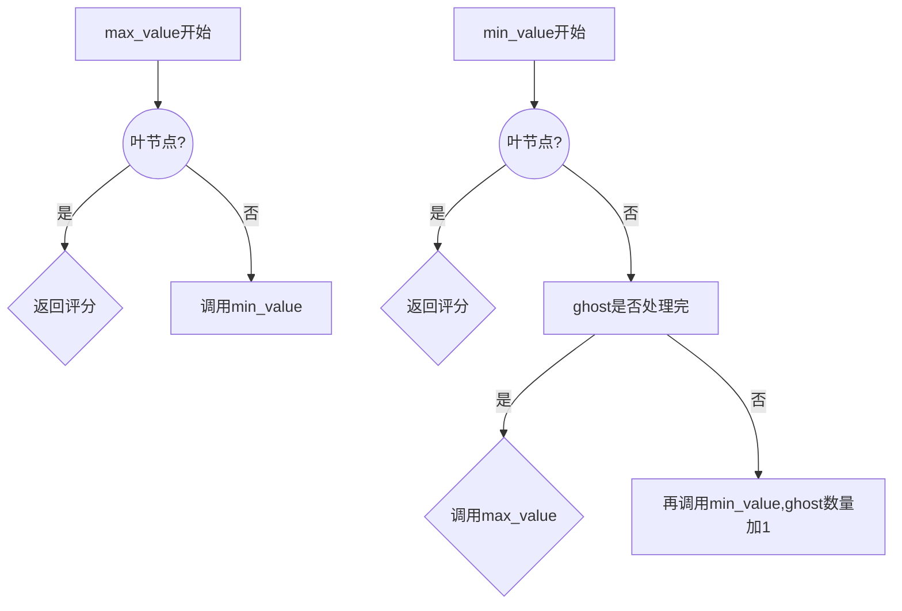
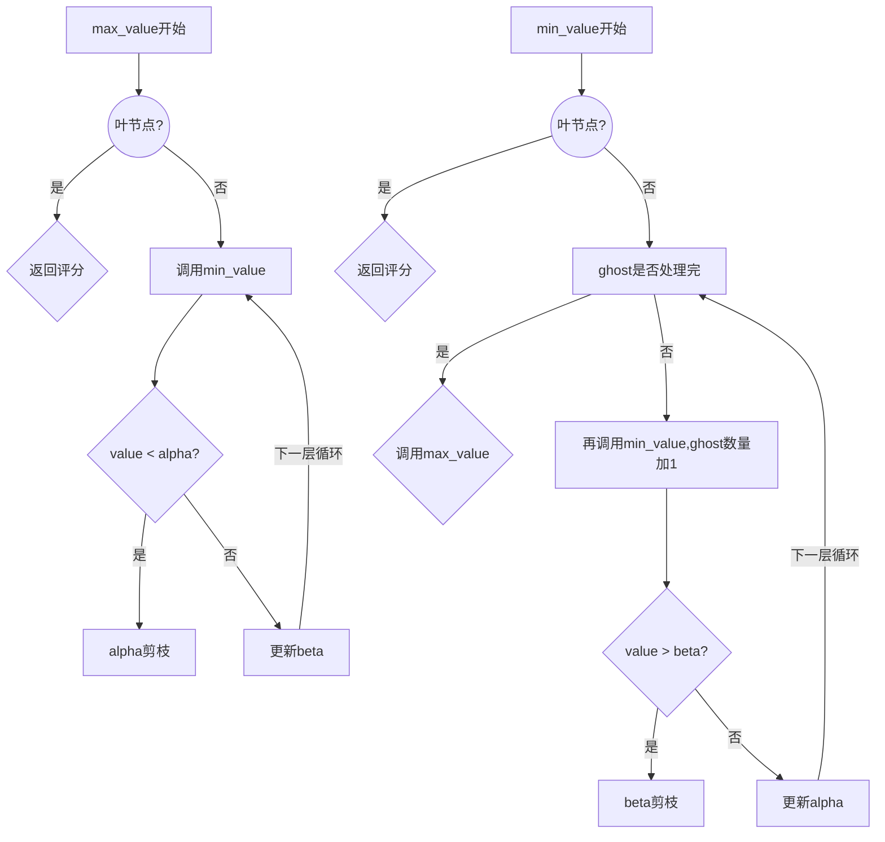
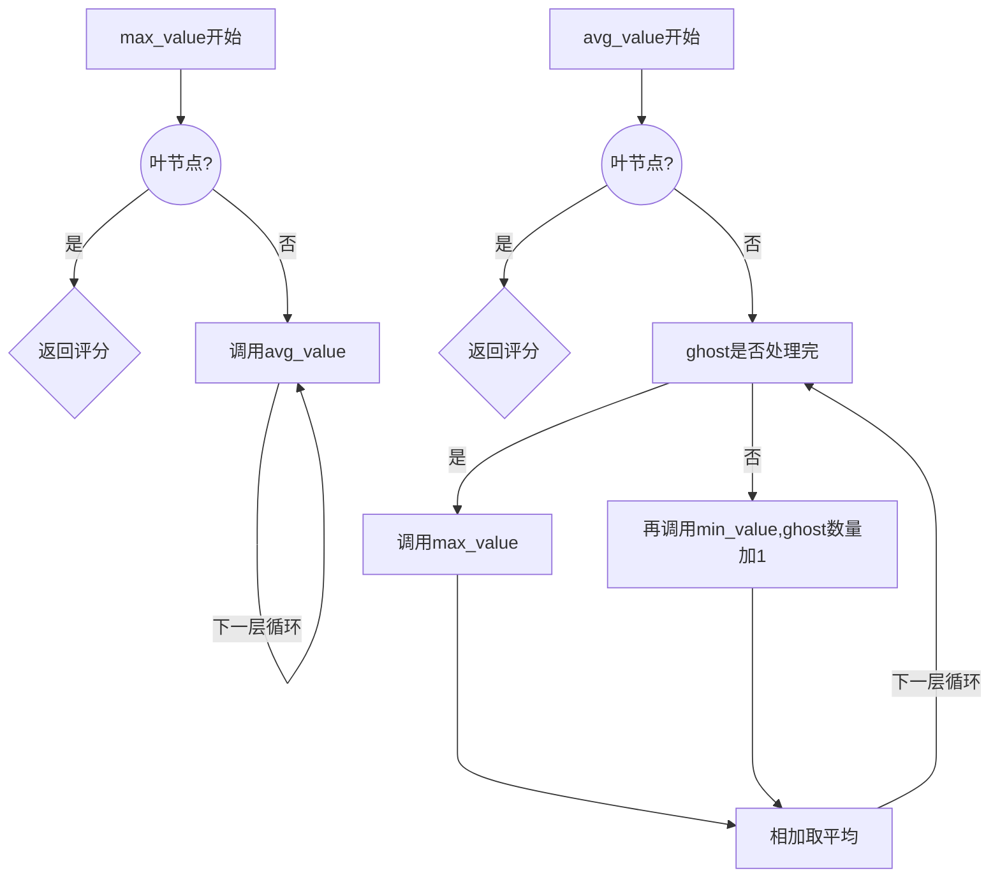

<center><h1>人工智能课程设计Project2-报告</h1></center>

## 一、问题概述

### 1.1 问题

在这个项目中，你将为经典版本的吃豆人设计代理，包括幽灵。在此过程中，您将实现 minimax 和 expectimax 搜索，并尝试评估函数设计。

### 1.2 对项目已有代码的阅读和理解

- **util.py**

  - 项目已实现了三种数据结构：栈(Stack)、队列(Queue)和优先队列(Priority Queue)。
  - 其中，栈和队列是基本的数据结构，优先队列则是在每个元素插入时赋予其一个优先级，然后快速检索最小优先级的元素。

- **multiAgents.py**

  - 该文件是本次作业主要需要实现的文件。内包含 4 种智能体，分别是 ReflexAgent, MinMaxAgent, AlphaBetaAgent, ExpectimaxAgent，每种智能体对应一种搜索方式。
  - 另外我们还需要实现一个评估函数，更好的评估当前局面，获得更高的分数。

## 二、算法设计与实现

### 2.1 Reflex Agent

#### 2.1.1 算法功能

- 该智能体基于当前游戏状态选择使评估函数最大化的动作。评估函数用于为每个可能的动作分配一个分数，该分数反映出该动作在游戏目标方面的好坏。智能体随后选择得分最高的动作并执行它。

#### 2.1.2 设计思路

- 仅考虑到最近的食物颗粒和最近的鬼之间的距离。
- 对鬼：离鬼的距离 <= 1，评分最低；离鬼的距离 > 1，忽略鬼怪影响
- 对食物：吃豆人到食物距离的倒数，这会给距离更近的事物更高的值。
- 上述的距离直接使用曼哈顿距离估计。且因为本题测试用例均没有墙，曼哈顿距离即实际距离

#### 2.1.3 代码实现

```python
        newNumFood = successorGameState.getNumFood()
        curFood = currentGameState.getFood()
        curWalls = currentGameState.getWalls()

        import math
        def disToClosestFood():
            ret = min([manhattanDistance(newPos, food) for food in curFood.asList()])
            if ret == 0:
                return 0.1
            return ret

        def disToClosestGhost():
            # 暂时先用曼哈顿距离，方便
            ret = min([manhattanDistance(newPos, ghost.configuration.pos) for ghost in newGhostStates])
            return ret

        score = 0
        if disToClosestGhost() <= 1:
            score = -math.inf
        score += 9 / disToClosestFood()
        return score
```

### 2.2 Minimax

#### 2.2.1 算法功能

- 实现 Minimax 搜索，使用深度优先搜索实现，可处理任意数量的幽灵。
- 主体是一个 max_value,一个 min_value,max_value 求取下一层 min_value 的最小值，min_value 求取下一层 max_value 的最大值。
- Minimax 算法是一种用于确定多方博弈的最优决策的算法，其中一个参与者试图最大化他的利益，而另一个参与者试图最小化他的损失。在每个节点处，玩家要么选择最大收益的行动（max 节点），要么选择最小收益的行动（min 节点）。这个过程不断递归进行，直到达到叶节点。在叶节点处，我们评估当前状态的分数，然后回溯到父节点，并根据子节点返回的最大值或最小值选择合适的行动。

#### 2.2.2 设计思路

- 首先，我们需要获取当前状态的代理数量 `numAgents`。
- 然后，我们使用深度优先搜索实现 Minimax 算法，使用一个 min_value，一个 max_value，然后两者交替调用，一起构成了深度优先搜索。
- 注意 ghost 数量很多，所以 min_value 要判断如果 ghost 没有搜索完，则在调用本身搜索下一个 ghost，只有这一层 ghost 全都处理完再处理下一层的 max_value（吃豆人）

#### 2.2.3 算法流程图



#### 2.2.4 代码实现

```py
        numAgents = gameState.getNumAgents()
        GhostIndex = [i for i in range(1, numAgents)]

        # 当前状态是否为游戏结束或者搜索到了限制层数
        def is_over(State, deep):
            return deep == self.depth or State.isWin() or State.isLose()

        # 采用递归方式把ghost每个走过的状态检查一遍
        def min_value(state, deep, ghost):  # minimizer
            if is_over(state, deep):
                return self.evaluationFunction(state)

            v = 1e6   # β初始值为无穷大
            for action in state.getLegalActions(ghost): # 递归的查找最小值
                if ghost == GhostIndex[-1]: # 如果ghost==ghostindex[-1]的话，说明这一层的幽灵已经查找结束，下一层查找吃豆人
                    v = min(v, max_value(state.generateSuccessor(ghost, action), deep + 1))
                else:                       # 反之寻找下一个幽灵，取最小值
                    v = min(v, min_value(state.generateSuccessor(ghost, action), deep, ghost + 1))
            return v

        def max_value(state, deep):  # maximizer

            if is_over(state, deep):
                return self.evaluationFunction(state)

            v = -1e6  # α初始值为无穷小
            for action in state.getLegalActions(0): # 递归查找最大值
                v = max(v, min_value(state.generateSuccessor(0, action), deep, 1)) # 在下一层查找幽灵
            return v

        # 从第一层开始查找，为max_value
        best_act = []
        best_val = -1e6
        actions = gameState.getLegalActions(0) # 0是吃豆人的代理
        for act in actions:
            val = min_value(gameState.generateSuccessor(0, act),0,1)
            if val > best_val:
                best_val = val
                best_act = act

        return best_act
```

### 2.3 Alpha-Beta Pruning

#### 2.3.1 算法功能

- Alpha-Beta pruning 是 Minimax 算法的改进，它通过对 Minimax 算法进行剪枝，减少了一部分不必要的搜索，从而提高了算法的效率。

- 该算法主要包括两个参数：alpha 和 beta。其中 alpha 代表 Max 结点能够保证的最小值，beta 代表 Min 结点能够保证的最大值。在搜索树的过程中，如果搜索到某个结点，发现它的 alpha 大于等于 beta 了，就可以剪掉该结点的子树，因为搜索到该结点的父节点时，即使采用其他路径，也不可能得到更好的解。

#### 2.3.2 设计思路

- 和 Minimax 算法一样，使用 min_value,max_value 交错搜索。
- 不同的是，在搜索时需要维护两个参数，alpha 和 beta，初始值分别为负无穷和正无穷，表示对于当前搜索到的 Max 结点和 Min 结点，它们能够保证的最小值和最大值。
- 对于 Max 结点，搜索其子结点时，若某子结点的值比当前的 beta 要大，则可以剪掉该结点，因为若采用该路径，Max 结点的值也不会比 beta 更小。
- 对于 Min 结点，搜索其子结点时，若某子结点的值比当前的 alpha 要小，则可以剪掉该结点，因为若采用该路径，Min 结点的值也不会比 alpha 更大。

#### 2.3.3 算法流程图



#### 2.3.4 代码实现

```python
        numAgents = gameState.getNumAgents()
        GhostIndex = [i for i in range(1, numAgents)]

        # 当前状态是否为游戏结束或者搜索到了限制层数
        def is_over(State, deep):
            return deep == self.depth or State.isWin() or State.isLose()

        # 采用递归方式把ghost每个走过的状态检查一遍
        def min_value(state, deep, ghost, alpha, beta):  # minimizer计算这一层的beta   alpha是上一层的alpha
            if is_over(state, deep):
                return self.evaluationFunction(state)

            v = 1e100   # β初始值为无穷大
            for action in state.getLegalActions(ghost): # 递归的查找最小值
                if ghost == GhostIndex[-1]: # 如果ghost==ghostindex[-1]的话，说明这一层的幽灵已经查找结束，下一层查找吃豆人
                    v = min(v, max_value(state.generateSuccessor(ghost, action), deep + 1, alpha, beta))
                else:                       # 反之寻找下一个幽灵，取最小值
                    v = min(v, min_value(state.generateSuccessor(ghost, action), deep, ghost + 1, alpha, beta))

                # 减枝
                if v < alpha:
                    return v
                beta = min(beta, v)
            return v

        def max_value(state, deep, alpha, beta):  # maximizer计算这一层的alpha    beta是上一层的beta

            if is_over(state, deep):
                return self.evaluationFunction(state)

            v = -1e100  # α初始值为无穷小
            for action in state.getLegalActions(0): # 递归查找最大值
                v = max(v, min_value(state.generateSuccessor(0, action), deep, 1, alpha, beta)) # 在下一层查找幽灵
                # 减枝
                if v > beta:
                    return v
                alpha = max(alpha, v)
            return v

        # 从第一层开始查找，为min_value
        best_act = []
        # best_val = -1e6
        alpha = -1e6
        beta = 1e6
        actions = gameState.getLegalActions(0) # 0是吃豆人的代理
        for act in actions:
            val = min_value(gameState.generateSuccessor(0, act), 0, 1, alpha, beta)
            if val > alpha:
                alpha = val
                best_act = act
        return best_act
```

### 2.4 Expectimax

#### 2.4.1 算法功能

- Minimax 和 alpha-beta 都很棒，但它们都假设您正在与做出最佳决策的对手对战。任何曾经赢得井字游戏的人都会告诉你，情况并非总是如此。expectmax 求解对手行为的期望而不是最佳决策作为最终决策

#### 2.4.2 设计思路

- 只需要改变 min_value 函数,改为 avg_value,不在求解最小值而是平均期望。遍历所有合法的操作，并计算它们带来的期望分数。将所有操作的期望分数取平均值，作为鬼的决策。

#### 2.4.3 算法流程图



#### 2.4.4 代码实现

```python
        numAgents = gameState.getNumAgents()
        GhostIndex = [i for i in range(1, numAgents)]

        # 当前状态是否为游戏结束或者搜索到了限制层数
        def is_over(State, deep):
            return deep == self.depth or State.isWin() or State.isLose()

        # 采用递归方式把ghost每个走过的状态检查一遍
        def evg_value(state, deep, ghost):  # minimizer计算这一层的beta   alpha是上一层的alpha
            if is_over(state, deep):
                return self.evaluationFunction(state)

            v = 0   # β初始值为无穷大
            prob = 1 / len(state.getLegalActions(ghost))
            for action in state.getLegalActions(ghost): # 递归的查找平均值
                if ghost == GhostIndex[-1]: # 如果ghost==ghostindex[-1]的话，说明这一层的幽灵已经查找结束，下一层查找吃豆人
                    v += max_value(state.generateSuccessor(ghost, action), deep + 1)
                else:                       # 反之寻找下一个幽灵，取最小值
                    v += evg_value(state.generateSuccessor(ghost, action), deep, ghost + 1)
            v = v * prob
            return v

        def max_value(state, deep):  # maximizer计算这一层的alpha    beta是上一层的beta
            if is_over(state, deep):
                return self.evaluationFunction(state)

            v = -1e100  # α初始值为无穷小
            for action in state.getLegalActions(0): # 递归查找最大值
                v = max(v, evg_value(state.generateSuccessor(0, action), deep, 1)) # 在下一层查找幽灵
            return v

        # 从第一层开始查找，为max
        best_act = []
        best_val = -1e6
        actions = gameState.getLegalActions(0) # 0是吃豆人的代理
        for act in actions:
            val = evg_value(gameState.generateSuccessor(0, act),0,1)
            if val > best_val:
                best_val = val
                best_act = act

        return best_act
```

### 2.5 评估函数

#### 2.5.1 算法功能

本题的任务是编写一个更好的评估函数，用于评估 Pacman 游戏中的状态，而不是像简单反射智能体评估函数那样评估动作。

#### 2.5.2 设计思路

评估函数应该考虑以下因素：

1. 距离最近的食物颗粒：Pacman 距离食物颗粒越近，得分越高。
2. 距离最近的幽灵：Pacman 距离最近的幽灵越远，得分越高。
3. 剩余食物颗粒数量：剩余的食物颗粒越少，得分越高。
4. 距离最近的胶囊：Pacman 距离胶囊越近，得分越高。
5. 游戏得分：游戏得分越高，得分越高。

#### 2.5.3 代码实现

该算法的大致思路如下：

1. 离鬼 2 格距离以上，不管，否则评分极低
2. score = 当前比赛得分
3. score -= 离最近的点的距离 (位置里食物越近越好)
4. score -= 剩余食物的数量 \* k (剩余食物的数量越少越好)
   因为 currentGameState 只能传进当前局面，不能知道这一步操作有没有被吃的 food

```python
    newPos = currentGameState.getPacmanPosition()
    newFood = currentGameState.getFood()
    newGhostStates = currentGameState.getGhostStates()
    # newCapsules = currentGameState.getCapsules()
    newScaredTimes = [ghostState.scaredTimer for ghostState in newGhostStates]
    walls = currentGameState.getWalls()

    # 如果不是新的ScaredTimes，则新状态为ghost：返回最低值
    newFood = newFood.asList()
    ghostPos = [(G.getPosition()[0], G.getPosition()[1]) for G in newGhostStates]
    scared = min(newScaredTimes) > 0
    if currentGameState.isLose():
        return float('-inf')
    if newPos in ghostPos:
        return float('-inf')

    # 计算食物距离和ghost距离分数
    closestFoodDist = sorted(newFood, key=lambda fDist: util.manhattanDistance(fDist, newPos))
    closestGhostDist = sorted(ghostPos, key=lambda gDist: util.manhattanDistance(gDist, newPos))
    # closestCapsules = sorted(newCapsules,key=lambda cDist: util.manhattanDistance(cDist, newPos))
    score = 0
    fd = lambda fDis: util.manhattanDistance(fDis, newPos)
    gd = lambda gDis: util.manhattanDistance(gDis, newPos)
    # cd = lambda cDis: util.manhattanDistance(cDis, newPos)

    # 越接近鬼得分越低
    if gd(closestGhostDist[0]) <3:
        score-=300
    if gd(closestGhostDist[0]) <2:
        score-=1000
    if gd(closestGhostDist[0]) <1:
        return float('-inf')

    # 离胶囊越近得分越高
    # if len(closestCapsules) != 0 and cd(closestCapsules[0]) <3:
    #     score += 200
    # if len(closestCapsules) != 0 and cd(closestCapsules[0]) <2:
    #     score += 200
    if len(currentGameState.getCapsules()) < 2:
        score+=100

    # 越接近食物得分越高
    if len(closestFoodDist)==0 or len(closestGhostDist)==0 :
        score += scoreEvaluationFunction(currentGameState) + 10
    else:
        score += (scoreEvaluationFunction(currentGameState) + 10/fd(closestFoodDist[0]) + 1/gd(closestGhostDist[0]) + 1/gd(closestGhostDist[-1])  )

    return score
```

## 三、实验结果

总分 25/25


### 3.1 反射智能体

#### 3.1.1 测试截图


### 3.2 MinMax 智能体

#### 3.2.1 测试截图


#### 3.2.2 测试用例

该题测试用例包括：

- 不同搜索深度
- 不同智能体数量
- 游戏环境测试

该 MinMax 智能体并不一定能在所有情况中获胜。

该智能体认为对手会采取最优策略，当他计算到当前状态必然失败时，可能会放弃坚持，直接死亡。

然而对手并不一定会采取最优策略，其实他还有获胜机会。

### 3.3 Alpha-Beta 剪枝

#### 3.3.1 测试截图


#### 3.3.2 测试用例

该题测试用例包括：

- 不同搜索深度
- 不同智能体数量
- 游戏环境测试

本题的结果与上一题完全一致，但是剪枝后可以降低状态空间复杂度，进而在相同的时间内增加搜索深度。

### 3.4 Expectimax 智能体

#### 3.4.1 测试截图


### 3.5 评估函数

#### 3.5.1 测试截图


## 四、总结与分析

- project2 实现了几种经典的游戏智能体算法，包括反射型智能体、Minimax、Alpha-Beta 剪枝和 Expectimax
- q1 设计了一个反射型智能体，它基于当前游戏状态选择使评估函数最大化的动作。评估函数考虑了吃豆人与最近食物的距离以及与最近幽灵的距离，以此来决定最佳动作。
- q2 实现了 Minimax 算法，通过深度优先搜索来确定游戏的最佳决策。该算法能够处理任意数量的幽灵，通过交替调用 max_value 和 min_value 函数来构建搜索树，并在叶子节点处评估当前状态的分数。
- q3 是对 Minimax 算法的改进，使用了 Alpha-Beta 剪枝来减少搜索空间，提高了算法的效率。在搜索树的过程中，通过维护 alpha 和 beta 值来剪枝，从而排除一些不必要的搜索分支。
- q4 是 Expectimax 算法，与 Minimax 不同的是，它求解对手行为的期望而不是最佳决策。我们修改了 min_value 函数，使其计算平均期望而不是最小值。
- q5 是设计一个评估函数，用于评估游戏状态的价值。该评估函数考虑了各种因素，包括离幽灵的距离、剩余食物数量和离胶囊的距离等，从而更准确地估计状态的价值。
