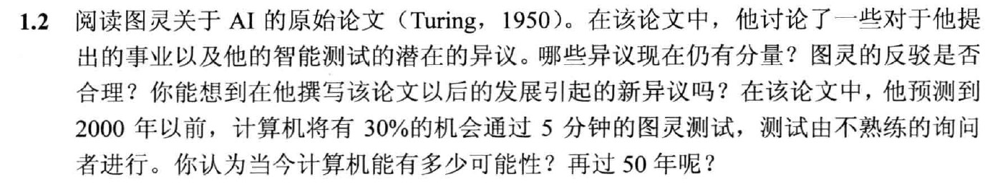

# 
第一次作业

#### 
 姓名：杨瑞灵 学号：2252941

---

### 1.阅读论文

- 感想：图灵在人工智能领域的贡献和前瞻性思考无疑是不可忽视的。他的论文《计算机器与智能》奠定了人工智能领域的基础，并激发了无数后续研究和讨论。其中关于学习机器这一块的设想，其实就是这几十年来机器学习所走的道路之一。

#### 1.1.模仿游戏

- 机器能思考吗?
- 这个游戏可能会被批评：

  - 机器在游戏的成败中占有过多的比重，如果一个人试图装成机器，他的表演显然非常糟糕，他会因为算术上的缓慢和不准确立即出局；机器可能不会做那些被认为是思考的事，与人的方式相差甚远？这个反对意见确实很棘手，但是，尽管如此，我们至少可以说，如果机器被设计得可以令人满意玩这个模仿游戏，那我们不必担心此异议。

  - 在玩“模仿游戏”时机器的最佳策略不是模仿人的行为。这是可能的，但我认为这种做法不可能有什么大的影响。在任何情况下，这里都不打算研究游戏理论，并且假定最优策略是努力提供和人一样的答案。

#### 1.2.机器

- 我们仅仅允许“数字计算机”参加我们的游戏。
- 为什么不拿一台直接作实验？
  - 我们并不是要问是不是所有的数字计算机都能在游戏中表现良好，也不是要问现在的计算机中有没有能够通过实验的，而是要问：**是否存在可想象的计算机能够通过游戏**。

#### 1.3.数字计算机的通用性

- 只要给出对应于离散状态机器的表格，就能够预测出机器将会做什么

#### 1.4.关于主要问题的对立观点

- 机器能思考吗

  - 作者：我相信，大约 50 年后计算机的存储量可达到 10^9 左右，使得在模仿游戏中会表现更好，这样以来一般提问者在提问 5 分钟后，能准确判断的概率不会超过 70％。我认为，原来那个“机器能思考吗？”的问题就没有什么意义，不值得讨论了。尽管如此，我认为本世纪末，由于语言和一般受教育观点会改变，那时候人们又能重新谈论机器思维而不感抵触。我还认为，掩盖这些信念不会有益处，人们普遍认为，科学家进行科学研究工作总是从可靠的事实到可靠的事实，从来不受任何未经证明的猜想所影响，这种看法实际上是错误的，只要能清楚地划分哪些是经过证明的事实，哪些是猜想，就不会有害处。猜想往往是非常重要的，因为它们提示有用的研究线索。

  - 来自神学的异议

  - “鸵鸟”式的异议

  - 来自数学的异议：数理逻辑中的一些结果可以用来指出离散状态机器能力的局限，其中最著名的就是哥德尔定理，此定理声称，在任何充分的逻辑系统中都能形成陈述，在本系统中既不能被证真，也不能被证伪，除非这个系统本身就是不一致的。数学的结论：此结论认定机器能力有限，而人类智能则没有这种局限性。

  - 来自意识的论点：这个论点在 Jefferson 教授于 1949 年的 Lister 演说中有很好的表达，我引用他的一段话：“若要我们承认机器等同于大脑，除非机器能够因为感受到思想与情绪，而不是偶然碰到符号涂写十四行诗或协奏曲。也就是说，它不仅写了，而且知道自己写了。任何机器都感觉不到（不只是人工信号，一个简单的图谋）成功的喜悦，保险丝跳闸的沮丧，被奉承而沾沾自喜，因犯错误的痛苦，被性爱所迷惑，也不会因欲望得不到满足而生气或沮丧。”

  - 来自各种能力限制的论点

#### 1.5 学习机器

- 我们把问题分为两部分：**儿童程序和教育过程**，两者密切相关。我们不能指望一下就找到一个好的儿童机器，我们必须对一个这样的机器进行教育试验，看其学习效果，然后再试另外一个，判断哪个更好。显然这个过程与进化有联系，通过这样类比：

  儿童机器的结构 = 遗传物质

  儿童机器的变化 = 变异

  试验者的决定的判断 = 自然选择

- 我们通常将**惩罚和奖励**与教学过程联系在一起，一些简单的儿童机器可以按照这种原则来构建或编程，使得遭到惩罚的事件不大可能重复，而受到奖励的事件则会增加重复的可能性。

- 对于什么样的复杂度更适合儿童机器可能有不同的看法，有人主张尽可能简单以保持通用性，有人主张嵌入一个完整的逻辑推理系统。

- 学习机器的一个重要特征是，老师通常对其内部发生的事情不了解。学习的过程并不会产生百分之百的确定结果，否则就不是学习了。

- 在一个学习机器中加入**随机元素**应该是明智的（参见第[445]页）。

- 我们希望机器最终能和人在所有纯智力领域竞争，但何处是**最好的开端**？甚至这也成为困难的选择。许多人认为抽象的活动，例如国际象棋可能是最好的选择；也有人认为最好用钱给机器买最好的传感器，然后教它听说英语，和教一个正常的小孩一样，教它命名事物等等。我并不知道正确的答案，但是我想两方面都应该试试。

### 2.哪些异议仍有分量

- 心灵哲学上的异议：一些人认为，图灵测试并不能真正测试机器是否具有智能，因为它只是检验了机器是否可以模仿人类的行为。真正的智能是否仅仅局限于行为模仿仍然是一个有争议的话题。

- 对智能本质的质疑：一些学者认为，图灵测试并没有涵盖智能的所有方面，例如创造力、情感等。因此，即使一个系统通过了图灵测试，也不能被视为真正具有智能。

- 社会和道德问题：一些人担心，如果人工智能系统被普遍接受，可能会对人类社会和就业造成负面影响。这些问题涉及到机器取代人类工作、隐私保护、道德责任等方面。

### 3.反驳是否合理

- 图灵在他的论文中提出了一些反驳上述异议的观点
- 他强调了机器能思考吗，是在询问机器可以**表现出智能的可能性**，而不是说找一些现在的机器看他能否通过图灵测试。
- 他针对智能的本质认为**行为更重要，而不是内在的思维**。在解答来自意识的论点时，他提到了认为一个物体能否思考不是说我成为它，然后看自己是否有逻辑和情感，因为成为一个事务是不可能做到的，所以我们只能通过计算机的行为去检测它是否达到了思考的程度。

### 4.以后的新异议

- **超级智能的威胁**：一些学者担心，当人工智能系统达到超级智能水平时，可能会对人类造成威胁，甚至可能失控。

- **数据隐私和伦理问题**：随着人工智能系统的普及和数据的大规模采集，数据隐私和伦理问题变得越来越重要。如何平衡数据的利用和个人隐私保护之间的关系是一个持续存在的问题。
  在伦理问题中，比较熟知的，比如自动驾驶的车撞了人该谁赔偿，甚至是在撞一个人和几个人中如何做出选择。法律法规如何指定，这都是需要考虑的。

### 5.当今计算机的可能性

- 关于图灵预测的问题，目前的计算机在图灵测试方面取得了一些进展，但还没有达到他预测的水平。现代计算机在特定领域的任务上已经表现得相当出色，但要通过真正意义上的图灵测试，仍然需要更多的研究和创新。
- 但是在机器学习这一块，的确是按照图灵所预测的方向发展，他的**儿童程序和教育过程**其实就是机器学习的过程。开端这一块，正如作者所建议的那样，AI 下棋和语言学习已经有了较为成熟的成果，相信在不久的将来人类可以实现正真的机器思考。
