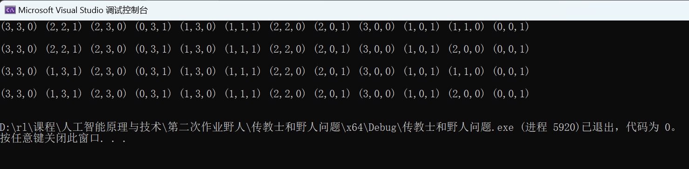

## <center> 第二次作业————传教士和野人问题 </center>

#### <center> 杨瑞灵 2252941 </center>

### 1.问题描述

- 三个传教士和三个野人在河的一岸，有一条能载一个人或者两个人的船。请设法使所有人都渡到河的另一岸，要求在任何地方野人数都不能多于传教士的人数。
- 这个问题在 AI 领域中很有名，是因为它是第一个从分析的观点探讨问题形式化的论文的主题(Amarel，1968)。
  - a.请对该问题进行详细形式化，只描述确保该问题求解所必需的特性。画出完整的状态空间图。
  - b.应用合适的搜索算法求出该问题的最优解。对于这个问题检查重复状态是个好主意吗?
  - c.这个问题的状态空间很简单，你认为是什么导致人们求解它很困难?

### a. 形式化描述

- 初始化状态：3 个野人 3 个传教士均在左岸，小船停在左岸

- 行动：将小船所在的岸边移动 1 或 2 个人到对岸，小船移动到对岸
  具体分为：

  - 1. 移动 1 野人
  - 2. 移动 1 传教士
  - 3. 移动 2 野人
  - 4. 移动 2 传教士
  - 5. 移动 1 野人和 1 传教士

- 转移模型：执行行动之后的状态改变，当前岸边的人减少，对岸的人增加，小船移动到对岸

- 目标测试：状态是否为所有人都在右岸。

- 路径耗散：每次行动消耗 1 个耗散值

- 状态：（a,b,c）

  - a: 左岸野人数量

  - b: 左岸传教士数量

  - c: 0 表示船在左岸，1 表示船在右岸

  初始状态（3,3,0），目标状态（0,0,1）

- 行动：（a,b）分别表示移动的野人数量和传教士数量

- 约束条件：要满足两岸野人都不能比传教士多，即满足

$$
左岸：a \le b ~或~b=0\\
右岸：3-a \ge 3 - b ~或~ 3-b=0 \\
化简：a = b ~或~ b = 0 ~或~ b = 3
$$

**总共 16 个合法状态**


#### 状态空间图

<center>


</center>

### b.搜索算法求最优解

- **DFS**

  - 搜索序列：

  ```
  (3,3,0) (2,3,1) (2,2,1) (2,3,0) (1,3,1) (0,3,1) (1,3,0) (1,+1,1) (2,2,0) (2,0,1) (3,0,0) (1,0,1) (1,1,0) (0,0,1)
  ```

  - 解序列：
    

  - 代码

  ```c++
  #include <iostream>
  #include <string>
  #include <vector>
  #include <map>
  using namespace std;
  class State {
  public:
      int a, b, c;
      State(int a, int b, int c) : a(a), b(b), c(c) {}

      bool is_legal()
      {
          return (a == b || b == 0 || b == 3) && (a >= 0 && a   <= 3) && (b >= 0 && b <= 3);
      }
      State next_state(int a, int b)
      {
          State ret(*this);
          if (ret.c == 0) {//如果船在左
              ret.a -= a;
              ret.b -= b;
              ret.c = 1;
          }
          else if (ret.c == 1) {//如果在右
              ret.a += a;
              ret.b += b;
              ret.c = 0;
          }
          return ret;
      }
      bool is_goal()
      {
          return (a == 0 && b == 0 && c == 1);
      }
      std::string to_string()
      {
          return "(" + std::to_string(a) + "," + std::to_string  (b) + "," + std::to_string(c) + ")";
      }
      friend bool operator==(const State& u, const State& v)
      {
          return u.a == v.a && u.b == v.b && u.c == v.c;
      }
  };

  vector<State> ans;
  map<std::string, bool> vis;
  // 五种移动状态
  constexpr int da[] = { 0, 0, 1, 1, 2 };
  constexpr int db[] = { 1, 2, 0, 1, 0 };
  bool dfs(State state, map<std::string, bool> vis0,   vector<State> ans0)
  {
      if (state.is_goal()) {
          for (State st : ans0) {
              std::cout << st.to_string() << ' ';
          }
          cout << endl << endl;
          return true;
      }
      // 遍历五种移动状态
      for (int i = 0; i < 5; i++) {
          State nxt_state = state.next_state(da[i], db[i]);
          if (!nxt_state.is_legal() || vis0[nxt_state.to_string  ()])
              continue;
          map<std::string, bool> vis1 = vis0;
          vector<State> ans1 = ans0;
          vis1[nxt_state.to_string()] = true;
          ans1.emplace_back(nxt_state);
          if (dfs(nxt_state, vis1,ans1))
              continue;
      }
      return false;
  }

  int main()
  {
      State init_state = { 3, 3, 0 };
      map<std::string, bool> vis0;
      vector<State> ans0;
      ans0.push_back(init_state);
      vis0[init_state.to_string()] = true;
      dfs(init_state, vis0, ans0);
      return 0;
  }
  ```

- **BFS**

  - 搜索序列：

  ```
  (3,3,0) (2,3,1) (2,2,1) (1,3,1) (2,3,0) (0,3,1) (1,3,0) (1,1,1) (2,2,0) (2,0,1) (3,0,0) (1,0,1) (1,1,0) (2,0,0) (0,0,1) (1,0,0)
  ```

  - 解序列：

  ```
  (3,3,0) (2,2,1) (2,3,0) (0,3,1) (1,3,0) (1,1,1) (2,2,0) (2,0,1) (3,0,0) (1,0,1) (1,1,0) (0,0,1)
  ```

  - 代码：

  ```c++
  #include <bits/stdc++.h>
  class State {
  public:
  	int a, b, c;
  	State(int a, int b, int c) : a(a), b(b), c(c) {}

  	bool is_legal()
  	{
  		return (a == b || b == 0 || b == 3)
              && (a >= 0 && a <= 3)
              && (b >= 0 && b <= 3);
  	}
  	State next_state(int a, int b)
  	{
  		State ret(*this);
  		ret.a += a * (c ? 1 : -1);
  		ret.b += b * (c ? 1 : -1);
  		ret.c = !ret.c;
  		return ret;
  	}
  	bool is_goal()
  	{
  		return (a == 0 && b == 0 && c == 1);
  	}
  	std::string to_string()
  	{
  		return "(" +
              std::to_string(a) + "," +
              std::to_string(b) + "," +
              std::to_string(c) + ")";
  	}
  	friend bool operator==(const State& u, const State& v)
  	{
  		return u.a == v.a && u.b == v.b && u.c == v.c;
  	}
  };

  std::vector<State> ans;
  std::map<std::string, bool> vis;
  constexpr int da[] = {0, 0, 1, 1, 2};
  constexpr int db[] = {1, 2, 0, 1, 0};

  int main()
  {
  	State init_state = {3, 3, 0};
  	ans.push_back(init_state);
  	vis[init_state.to_string()] = true;

  	std::queue<State> que;
  	que.push(init_state);
  	while (!que.empty()) {
  		State cur = que.front();
  		que.pop();

  		for (int i = 0; i < 5; i++) {
  			State nxt = cur.next_state(da[i], db[i]);
  			if (!nxt.is_legal() || vis[nxt.to_string()]) continue;
  			vis[nxt.to_string()] = true;
  			que.push(nxt);
  			ans.push_back(nxt);
  		}
  	}

  	for (State st : ans) {
  		std::cout << st.to_string() << ' ';
  	}

  	return 0;
  }
  ```

#### 检查重复状态

- 必须检查重复状态，因为有些路径可能会导致无限循环。
- 而这样的解即使能够到达终点，也会有更简单的路径（即去掉重复环的路径）实现最终任务，也就是说这样的解可以舍去。

### c.求解困难的原因

- 这个问题之所以难以解决，主要是因为在移动过程中必须满足特定的条件（野人数量不能多于传教士数量），这增加了搜索空间。
- 问题的状态空间虽然不大，但是有许多不同的移动顺序和组合，并且如果检查重复状态，理论上是有无数种方法可以到达终点的
