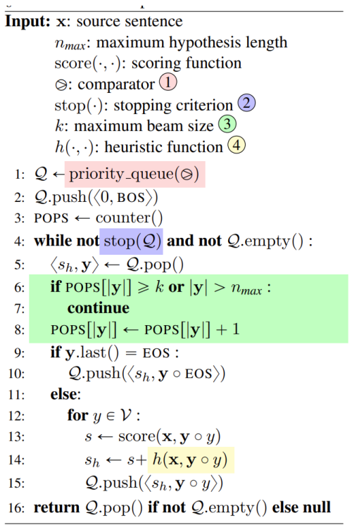

<h1><B>A* & Best-First Beam Search 论文笔记</B></h1>

### 1. A\*算法

**E. Hart, N. J. Nilsson, and B. Raphael. A formal basis for the heuristic determination of minimum cost paths in graphs. IEEE Trans. Syst. Sci. and Cybernetics, SSC-4(2):100-107, 1968.**

#### 1.1 A\*的实现

- 对于搜索算法来说，要想在搜索最优路径时扩展尽可能少的节点，该算法必须寻找关于下一个扩展哪个节点的决定。因此，一个有效的算法显然需要一些方法来评估可用节点，以确定下一个应该扩展哪个节点。

#### 1.2 评价函数（evaluation function）的定义

- 对任何子图$G_s$和任何给定的目标$T$，设评价函数（evaluation function）表示对节点计算的权值，它是限制该路径通过节点的情况下，从起点到终点的最优路径的实际成本。具有$f$的最小值的可用节点是接下来在算法中需要被扩展的节点。
- 对子图$G_a$，若存在节点$n$，使得$f(n)=f(s)$，说明节点$n$在最优路径上；若$f(n)>f(s)$，说明节点不在最优路径上。由于$f(n)$不是先验的，因此在每轮迭代中，使用一个对$f(n)$的估计价值作为评价函数$\^{f}(n)$
- 我们可以将$f(n)$写成如下两部分：$$f(n) = g(n)+h(n)$$
- 其中，$g(n)$表示从起点 s 到 n 的最优路径的实际成本，$h(n)$表示从节点 n 到目标 T 的最优路径的实际成本。

#### 1.3 算法流程

我们可以按照如下步骤，执行 A\*搜索算法：

- 将起点 s 放入到“开放列表”（open list）中，
- 重复如下过程：
  - 遍历开放列表，计算列表中每一个节点 n 的评价函数$f(n)$。查找$f(n)$值最小的节点 n，把它作为当前要处理的节点。
  - 对当前节点 n 中，与之相邻的其他所有节点，做如下操作：
    - 若节点 b 是不可抵达的或者在关闭列表中，忽略它。否则，做如下操作。
    - 若节点 b 不在开放列表中，则将其加入开放列表，并将当前节点 n 设置为其父亲节点。计算节点 b 的$f(b)$,$g(b)$和$h(b)$。
    - 若节点 b 已经在开放列表中，则需要检查这条路径是否更好。参考指标为$g$值，若$g$更小，则说明该路径更好。若这条路径更好，则将它的父亲节点（设为节点 e）设置为当前节点，并重新计算$g(e)$和$f(e)$。
  - 将 n 移动到“关闭列表”（closed list）中。关闭列表中的所有元素已经不需要被关注。
- 当满足如下条件中的一个时，程序终止。
  - 将终点加入到了开放列表中（此时路径已经找到了）。
  - 无法查找到终点，并且此时开放列表是空列表（此时没有路径）。
- 若终点已经找到，查找最短路径：从终点开始，每个节点都沿着父亲节点移动，直到起点。

#### 1.4. 评价函数的估计和计算方法

- 对$g$的估计:可以直接算出来
- 对$h$的估计:
  - 它是 A\*算法中的最特别之处，是“启发式”体现的核心，也是与 Dijkstra 算法相比，差别最大的部分。
  - 令$\^{h}(n)$为$h(n)$的一个估计。估计过程通常被称为试探法，因为估计过程是从当前节点向终点（尚未探测到的节点）的一种估计。估计的准确度依赖于问题域中可用的信息数。
  - 从下表可知，选择一个好的启发函数是重要的。
    | 情况 | 函数 | 结果 |
    |--------------------------|------------------------------------|-----------------------------------|
    | \(\hat f(n)=\hat g(n)\) | 退化为 Dijkstra 算法 | 能找到最短路径 |
    | \(\hat h(n)\leq\) 实际代价 | \(\hat h(n)\)越小，A\*扩展的节点越多 | 能找到一条最短路径，运算更快 |
    | \(\hat h(n)=\) 实际代价 | 仅寻找最佳路径，不扩展别的节点 | 能找到最短路径，运算非常快 |
    | \(\hat h(n)>\) 实际代价 | 寻找最佳路径且扩展别的任何节点 | 不能保证找到最短路径，但运算更快 |
    | \(\hat h(n)\gg\hat g(n)\) | A\*算法退化为 BFS 算法 | 不能保证找到最短路径，但运算非常快 |
  - 所以得到一个很有趣的情况，那就是可以决定想要从 A\*中获得什么。理想情况下，我们想最快地得到最短路径；但如果目标太低，仍会得到最短路径，不过速度变慢了；如果目标太高，那就放弃了最短路径，但它运行得更快。
  - A\*的这个特性非常有用，例如在某些情况下，希望得到一条好的路径（“good” path）而不是一条完美的路径（“perfect” path），为了权衡
    $g(n)$和$h(n)$，可以修改任意一个的权重。

### 2.Beam Search

**Clara Meister, Tim Vieira，Ryan Cotterell, Best-First Beam Search， Transactions of the Association for Computational Linguistics, vol. 8, pp. 795–809, 2020.**

#### 2.1.Beam Search 概述

Beam Search（束搜索）是一种基于贪心策略的搜索算法，用于在结构化预测模型中确定给定输入下得分最高的输出序列。

Beam Search 通过限制搜索空间中保留得分最高的前 K 个序列，来在实际可接受的时间内找到一个次优解。

Beam Search 是 NLP 任务中常用的启发式搜索算法，被广泛用于机器翻译、语音识别和文本生成等领域。

#### 2.2.Beam Search 基本算法

设最终长度为 n，代码中的 B 表示一个优先队列。

生成的结果长度逐个增加。每次将上一个优先队列中的所有结果依次与字符表中的所有字符组合形成新的字符串，并对其评分，存入新的优先队列中。

当每一个长度的所有情况遍历结束后，取优先对列的最大 k 项作为该长度的最终结果。

#### 2.3.A\*优化

在原版的代码基础上，score 增加了一个启发函数的值。原来的 score 只是评价到当前状态对对分数，h 将预测之后的状态。

与原版不一样的是，A\*Beam Search 并不是严格的顺次增加字符串长度，而是将生成的新字符串一起塞进一个优先队列里，统一进行排序。

对每一个长度的字符串进行计数，当达到 k 个之后，就跳过之后该长度的字符串。因为同一长度里前 k 个先取到的字符串一定是评分最高的 k 个。

搜索的终止条件就是，当前队列得分最高的字符串已经结束（取到 EOS）。即 Q.top().y.last() == EOS

#### 2.4.为什么 A\*在这里有效

传统的 beam search 虽然通过限制搜索空间解决了问题，但仍存在计算效率低下的问题——即我们必须先分析给定长度（即时间步长）的 k 个假设，而不管它们的分数已经有多差，然后再考虑更长的假设。

然而，根据长度进行排序并不是寻找 k 最优假设的必要条件。就像在 A\*算法中一样，我们可以使用分数作为优先级方案，并仍然保证该算法返回的路径是最优的或者是 k 最优的。

通过将 beam search 与 A\*算法相结合，将广度搜索限制在 beam size k 以内，同时使用得分作为优先级指标，可以使算法更快地找到最优或 k 个最优的候选序列。此外，通过优先级排序，可以在遇到第一个完整的序列时立即停止算法，从而进一步提高效率。这些优化的关键是评分函数的单调性，对于单调的评分函数，可以保证这些算法的最优性。

#### 2.5.对该算法的空间优化

原本的 beam search 限制了最大的空间限度为 k，而 A\*开的优先队列，最坏情况下可能达到 O(k n~max~).

这里采取做法是当队列的容量达到上限 k 时，删除当前队列中最后的元素。可以保存所有元素的指针所以删除可以优化成 O(1)。

是一个性价比很高的时间换空间。

之后文章是一些时空复杂度分析和算法正确性证明，就省略了。

#### 2.6.评估函数和启发式

对于语言生成任务，常常使用一些神经网络模型来做评判。这篇文章并没有详细的描述这个问题，而是提出了几个方案进行优化。

本文提供了两个优化思路。

长度规范化：假设长度来抵消神经模型下较短序列具有较高得分的倾向

Maximum mutual information decoding：最大化互信息，缓解原模型易选泽高频词的问题。
